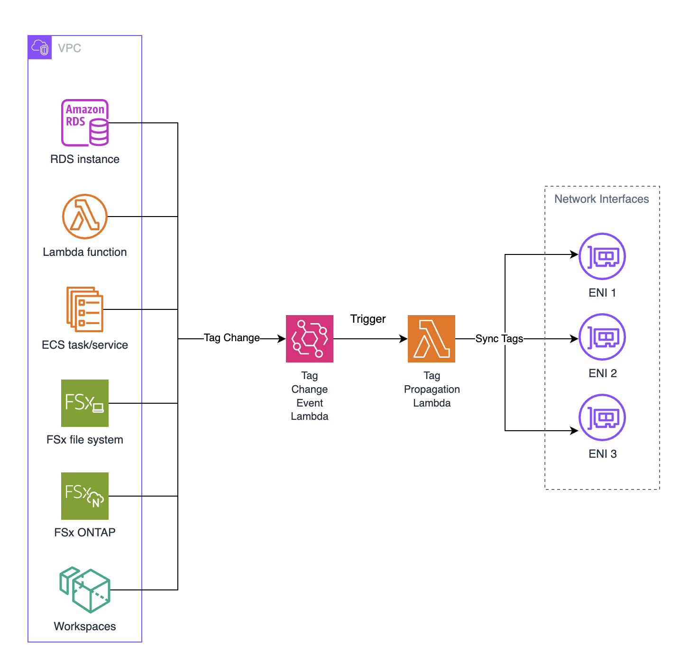

# Tag Event Capture - Automated ENI Tag Propagation

## Description

This solution provides automated tag propagation from AWS resources to their associated Elastic Network Interfaces (ENIs). When tags are added, modified, or removed from supported AWS resources, the solution automatically synchronizes these changes to the corresponding ENIs.

This automation is particularly useful for:
- Tag-based firewall rules that rely on ENI tags
- Network security policies based on resource tagging
- Compliance and governance requirements

### Supported AWS Services

- **Lambda Functions** (VPC-enabled): Automatically propagates tags to ENIs created for Lambda functions running within a VPC. The solution identifies Lambda-specific ENIs using their description pattern.

- **ECS Tasks**: Handles tag propagation for ECS tasks with network interfaces. While ECS has a native tag propagation feature, it only applies to newly created tasks. This solution extends coverage to existing running tasks.

- **RDS Instances**: Resolves RDS endpoint DNS names to identify associated ENIs and propagates tags accordingly. Supports both single-AZ and Multi-AZ deployments.

- **FSx File Systems**: Propagates tags to the network interfaces used by FSx file systems of type Windows and ONTAP.

- **WorkSpaces**: Identifies WorkSpace ENIs using the workspace IP address and ensures tag consistency across the workspace infrastructure.

The solution monitors tag changes with a configurable prefix (default: `fw-`) and automatically propagates them to associated ENIs.

## Architecture



*Architecture Overview: The solution uses EventBridge to monitor tag changes on AWS resources, triggers a Lambda function to process the events, and automatically propagates tags to associated ENIs.*

### Architecture Components

1. **EventBridge Rule**: Monitors tag change events for supported AWS services
2. **Lambda Function**: Processes events and handles tag propagation logic
3. **IAM Role**: Provides least-privilege permissions for AWS API access
4. **Dead Letter Queue**: Handles failed Lambda invocations with SQS encryption
5. **CloudWatch Logs**: Stores execution logs for monitoring and debugging

### Data Flow

1. Tag changes occur on supported AWS resources (Lambda, ECS, RDS, FSx, WorkSpaces)
2. EventBridge detects changes to tags with the configured prefix
3. Lambda function is triggered with the resource change event
4. Lambda queries the resource to get current tags and identify associated ENIs
5. Lambda synchronizes tags from the resource to its ENIs (add/update/delete)
6. Process completes with logging for audit and troubleshooting

## Deployment Instructions

### Prerequisites
- AWS CLI configured with appropriate permissions
- CloudFormation deployment permissions
- IAM permissions to create roles and policies

### Deploy the Solution

1. **Clone or download the template**
   ```bash
   git clone https://github.com/aws-samples/sample-automated-tag-sync.git
   cd sample-automated-tag-sync
   ```

2. **Deploy the CloudFormation stack** (choose one option):

   **Option A: Using AWS CLI**
   ```bash
   aws cloudformation create-stack \
     --stack-name tag-propagation-stack \
     --template-body file://template.yaml \
     --capabilities CAPABILITY_NAMED_IAM \
     --parameters ParameterKey=TagPrefix,ParameterValue=fw- \
     --region <your-region>
   ```

   **Option B: Using AWS Console**
   - Navigate to CloudFormation in AWS Console
   - Click "Create stack" → "With new resources"
   - Upload the `template.yaml` file
   - Provide a stack name (e.g., `tag-propagation-stack`)
   - Configure the `TagPrefix` parameter (default: `fw-`)
   - Check "I acknowledge that AWS CloudFormation might create IAM resources with custom names"
   - Click "Create stack"

3. **Verify Deployment**
   - Check CloudFormation stack status is `CREATE_COMPLETE`
   - Verify the Lambda function is created (will have an auto-generated name like `<StackName>-TagPropagationLambda-<RandomString>`)
   - Confirm the EventBridge rule is active and monitoring tag changes
   - Check that the SQS Dead Letter Queue is created for error handling

### Configuration

**Parameters:**
- `TagPrefix`: Configurable tag prefix to monitor (default: `fw-`)
  - Must contain only alphanumeric characters, hyphens, and underscores
  - Can be customized during stack deployment

The solution automatically:
- Monitors the deployment region
- Tracks tags with the specified prefix
- Targets all supported AWS services listed above

## Security Considerations

When implementing tag-based firewall rules, strict control over tagging permissions is critical for maintaining security posture:

- **Tag Prefix Protection**: This solution monitors tags with the configured prefix (default: `fw-`). Ensure that permissions to create, modify, or delete tags with this prefix are granted only to authorized personnel and automated systems.

- **IAM Policy Enforcement**: Implement restrictive IAM policies that limit who can apply `fw-*` tags to resources. Consider using tag-based access control policies to enforce this at the organizational level.

- **Audit and Monitoring**: Enable CloudTrail logging for all tagging operations to maintain an audit trail of who modified firewall-related tags and when.

- **Principle of Least Privilege**: The Lambda function's IAM role includes only the minimum permissions required for tag propagation operations.

- **Lambda Environment Variable Encryption**: Lambda environment variables use default encryption.

## Acknowledgments

This project was built together with **[Michal Reznik](https://www.linkedin.com/in/michal-resnik/)** from **[AllCloud](https://allcloud.io/)**, who was instrumental in developing this automated tag propagation solution.
